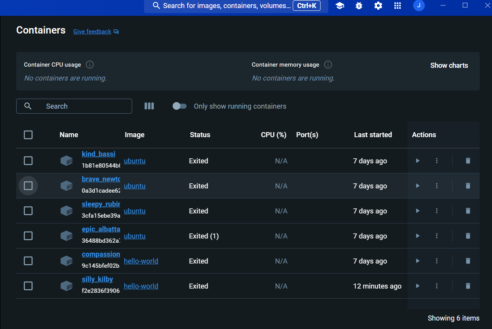

# Container 

## Einführung 
### Was sind überhaupt Container?

Ein Container in der Informatik ist eine Methode, um eine Anwendung mit all ihren Abhängigkeiten in einer isolierten Umgebung zu verpacken. Dies ermöglicht es, die Anwendung konsistent und zuverlässig auf verschiedenen Computern oder in verschiedenen Umgebungen auszuführen. Ein Container enthält nicht nur die Software selbst, sondern auch alle notwendigen Bibliotheken, Binärdateien und Konfigurationsdateien, die für das Ausführen der Anwendung erforderlich sind.

### Was ermöglichen Container?

#### Isolation: 
Jeder Container läuft in einer eigenen Umgebung. Dies bedeutet, dass Anwendungen in Containern nebeneinander auf demselben Host-System laufen können, ohne sich gegenseitig zu beeinflussen. Dies erleichtert die Verwaltung von Abhängigkeiten und verbessert die Sicherheit.

#### Portabilität(Übertragbarkeit): 
Da ein Container alle Abhängigkeiten einer Anwendung umfasst, kann er leicht von einer Umgebung in eine andere verschoben werden. Dies ist besonders nützlich in Entwicklungs- und Deployment-Prozessen, da es die "Es funktioniert auf meinem Rechner"-Problematik eliminiert.

#### Effizienz: 
Container nutzen die Betriebssystemebene für die Virtualisierung und sind daher effizienter als traditionelle virtuelle Maschinen, die einen vollständigen Gastbetriebssystemkern ausführen. Container starten schneller und benötigen weniger Ressourcen.


## Docker 

### Was ist Docker 
Docker ist eine beliebte Open-Source-Plattform und ein Tool, das die Entwicklung, Bereitstellung und Ausführung von Anwendungen in Containern vereinfacht. Es ermöglicht Entwicklern und Systemadministratoren, Anwendungen samt ihren Abhängigkeiten in Container zu verpacken, um Konsistenz, Effizienz und Portabilität über verschiedene Umgebungen hinweg zu gewährleisten.

#### Docker-Images: 
Ein Docker-Image ist eine unveränderliche Datei, die eine Momentaufnahme einer Anwendung und ihrer Umgebung darstellt. Jedes Image enthält alles, was notwendig ist, um eine Anwendung auszuführen, einschließlich des Codes, der Laufzeitumgebung, Bibliotheken, Umgebungsvariablen und Konfigurationsdateien.

#### Docker-Container: 
Ein Container ist eine laufende Instanz eines Docker-Images. Container sind isoliert von anderen Containern und dem Host-System, teilen sich jedoch den Kernel des Host-Betriebssystems und, wo angebracht, auch die Binärdateien und Bibliotheken. Dies macht sie leichter und schneller als traditionelle virtuelle Maschinen.

#### Dockerfile:
Ein Dockerfile ist eine Textdatei, die die Schritte zum Erstellen eines Docker-Images beschreibt. Es enthält Anweisungen für das Basis-Image, das hinzugefügt werden soll, die auszuführenden Befehle, die zu kopierenden Dateien und Ordner, und andere Konfigurationseinstellungen.

#### Docker Hub und Docker Registry: 
Docker Hub ist eine Cloud-basierte Registry, die es ermöglicht, Docker-Images zu speichern, zu teilen und zu verwalten. Es dient als zentralisierte Ressource für das Finden und Herunterladen von bestehenden Docker-Images. Private und unternehmensinterne Registries ermöglichen die sichere Speicherung und Verwaltung eigener Images.

## Auftrag 
Ich habe den Docker auf meinem Windows Rechner Installiert und konnte die Standard Tests erfolgreich abschliessen.
Die Docker Ps und Docker Images befhele habe ebenfall gemacht. Mit den Docker Ps befhelen kriegt man ein überblick über die aktuellen Container, wie z.B. Namen, IDs und Status.

### Docker Standard-Test resultat



### Docker PS(Details) befehle

Aktive Container anzeigen:
```
docker ps
```
Aktive und beendete Container anzeigen (all):
```
docker ps -a
```

Nur IDs ausgeben (all, quit):
```
docker ps -a -q
```

## Docker image 

Lokale Images ausgeben:
```
docker images
```

Docker Container löschen:
```
docker rm [name]
```

Alle beendeten Container löschen:
```
docker rm `docker ps -a -q`
```

Alle Container, auch aktive, löschen:
```
docker rm -f `docker ps -a -q`
```

Docker Image löschen:
```
docker rmi ubuntu
```

Zwischenimages löschen (haben keinen Namen):
```
docker rmi `docker images -q -f dangling=true`
```
