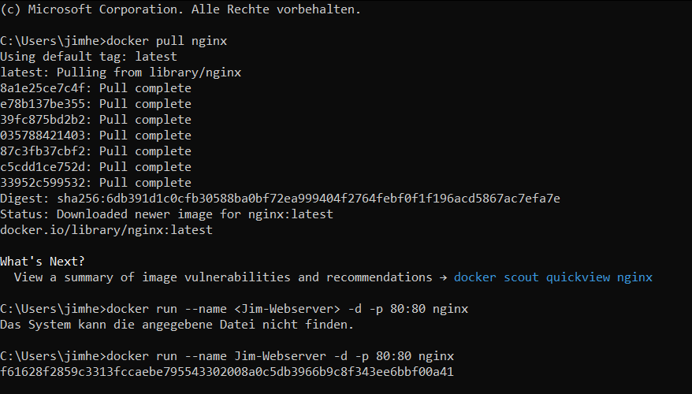

# Nginx Webserver Aufsetzten

## Docker-Image für den Webserver herunterladen
Zuerst ziehen (pull) Sie das offizielle nginx-Image von Docker Hub:


## Docker-Container erstellen und starten

Erstellen und starten Sie einen Docker-Container basierend auf dem nginx-Image. Der folgende Befehl startet einen nginx-Container und macht ihn über Port 80 auf Ihrem Host-System erreichbar. Ersetzen Sie <Container-Name> mit einem Namen Ihrer Wahl für den Container:
```
docker run --name <Container-Name> -d -p 80:80 nginx
```



