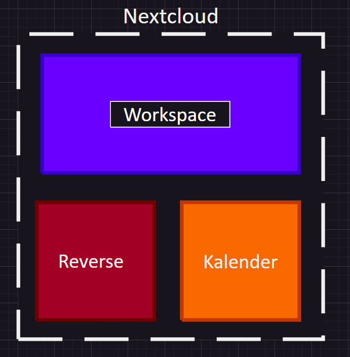

# Projekt Workspace auf Container

## Projekt Planung 

### Ziel der Projektarbeit 
Das Ziel der Projektarbeit ist es ein Workspace zu erstellen mit Workbook und Kalender das auf Containers leuft.

### Komponenten 
Wir benutzen ein Nextcloud Image(https://hub.docker.com/_/nextcloud) in welchem wir einen reverse proxy, und ein Workspace aufsetzen.

Netzwerkplan 
-Workbook und Kalender - nextcloud 

### Evaluation Nextcloud
| Aspekt            | Separate Container | Bewertung (Separate Container) | Nextcloud | Bewertung (Nextcloud) |
|-------------------|--------------------|-------------------------------|-----------|-----------------------|
| Einfachheit      | Das Einrichten und Verwalten mehrerer Container kann besonders für Anfänger komplex sein. Jeder Service erfordert seine eigene Konfiguration und Verwaltung. | 3 | Nextcloud bietet eine einzige Plattform zur Verwaltung mehrerer Komponenten. Das Hinzufügen neuer Komponenten kann relativ einfacher sein, da es in das Nextcloud-Ökosystem integriert ist. | 5 |
| Funktionen         | Jeder Service kann unabhängig angepasst werden, was eine größere Flexibilität bei der Auswahl spezifischer Konfigurationen und Versionen ermöglicht. | 4 | Die Integration mit Nextcloud kann die Anpassungsoptionen einschränken, da die Komponenten mit der Nextcloud-Umgebung kompatibel sein müssen. Es bietet jedoch eine nahtlose Integration mit den bestehenden Funktionen und Funktionalitäten von Nextcloud. | 3 |
| Sicherheit          | Jeder Container kann isoliert werden, was die Sicherheit erhöhen kann, indem die Angriffsfläche reduziert wird. Die ordnungsgemäße Konfiguration der Sicherheit für jeden Container ist jedoch unerlässlich. | 4 | Nextcloud bietet ein zentrales Sicherheitsmodell, das die Verwaltung und Überwachung vereinfachen kann. Schwachstellen in den hinzugefügten Komponenten könnten jedoch die gesamte Nextcloud-Instanz beeinträchtigen. Regelmäßige Updates und Sicherheitspatches sind dennoch erforderlich. | 3 |
| Skalierbarkeit       | Die Skalierung einzelner Dienste kann mehr Aufwand erfordern, da jeder Container separat verwaltet werden muss. Es bietet jedoch eine genauere Kontrolle über die Ressourcenzuweisung für jeden Dienst. | 3 | Der modulare Ansatz von Nextcloud ermöglicht eine einfachere Skalierbarkeit durch Hinzufügen oder Entfernen von Komponenten nach Bedarf. Bei der Skalierung müssen jedoch Kompatibilitäts- und Leistungsüberlegungen berücksichtigt werden. | 4 |
| Wartung       | Das Aktualisieren und Verwalten mehrerer Container kann zeitaufwändig sein, da jeder Dienst seinen eigenen Update-Zeitplan und seine eigenen Abhängigkeiten haben kann. | 3 | Nextcloud vereinfacht die Wartung durch Konsolidierung von Updates und Verwaltungsaufgaben innerhalb einer einzigen Plattform. Bei Updates können jedoch Kompatibilitätsprobleme zwischen Nextcloud und den hinzugefügten Komponenten auftreten. | 4 |
| Integration       | Erfordert manuelle Konfiguration und Integration jedes Dienstes mit externen Komponenten wie Datenbanken, Authentifizierungssystemen usw. | 3 | Nextcloud bietet eine integrierte Integration mit verschiedenen Diensten und Anwendungen durch ihr App-Ökosystem. Nicht alle Drittanbieterdienste sind jedoch mit Nextcloud kompatibel oder erfordern möglicherweise zusätzliche Konfiguration. | 4 |
| Community-Support | Jeder Dienst kann seine eigene Community und Supportkanäle haben, die in Verfügbarkeit und Qualität variieren können. | 3 | Nextcloud hat eine große und aktive Community, die Unterstützung und Ressourcen für sowohl Kernfunktionen als auch Drittanbieterintegrationen bietet. | 5 |
| Gesamt           | Geeignet für Projekte, die spezifische Konfigurationen oder eigenständige Dienste erfordern. Bietet mehr Kontrolle, erfordert jedoch mehr Aufwand bei Einrichtung und Verwaltung. | 3,29 | Ideal für Projekte, die eine zentrale Lösung mit integrierten Funktionen suchen. Bietet Einfachheit und Bequemlichkeit, kann jedoch Einschränkungen bei Anpassung und Skalierbarkeit haben. | 4,00 |
### Netzwerkplan




## Nextcloud Container

### Image Nextcloud
```
docker run ^
--init ^
--sig-proxy=false ^
--name nextcloud-aio-mastercontainer ^
--restart always ^
--publish 80:80 ^
--publish 8080:8080 ^
--publish 8443:8443 ^
--volume nextcloud_aio_mastercontainer:/mnt/docker-aio-config ^
--volume //var/run/docker.sock:/var/run/docker.sock:ro ^
--env SKIP_DOMAIN_VALIDATION=true ^
nextcloud/all-in-one:latest
```
Das ist das Nextcloud Image das ich verwende für meinne Workspace.

# Nextcloud AIO 

## Domain auf Hostdatein hinzufügen


Ich habe hier die Domain die ich für nextcloud verwenden werde hinzugefügt.
Meine Domain(Nextcloud): www.jimheft.ch

## Submit Domain


Ich habe meine Domain bei nextcloud erfolgreich Submitet.
Meine Domain die Submitet habe ist www.jimhefti.ch

## Download und Start Containers

### Ausgewählte container 


